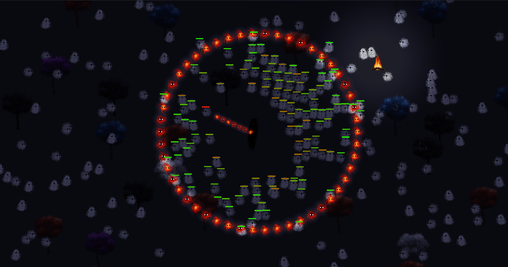

# About
A simple C game engine created for educational purposes.
You can view a demo game created with this engine [here](demo).

# Features
## Core
* Entity-component
* TMap for searching components by type in the scene in O(1) time
* Chunks for finding all components within a rectangle in O(1) time, including the ability to filter by type in O(1)
* Components without a specific global update callback consume zero CPU time. Components can define a specific callback that the engine invokes only when the component is visible to the camera or within the simulation radius
* Entity and component identifiers to prevent the dangling pointer problem
* A simple DSL for asset management and scene setup
## Rendering
* Lazy texture loading
* Tilesets
* Light map
* Rendering layers
* Y-based sorting
## Physics
* Colliders
* Collision layers
* Collision triggers (on_enter, on_exit)
* Rigid bodies (physical based movement, friction, law of conversion of momentum, restitution)
## Other
* A development mode supporting hot reloading via a hotkey or upon changes to the scene file on disk
* A simple profiler for measuring frame time components
* Behavior trees